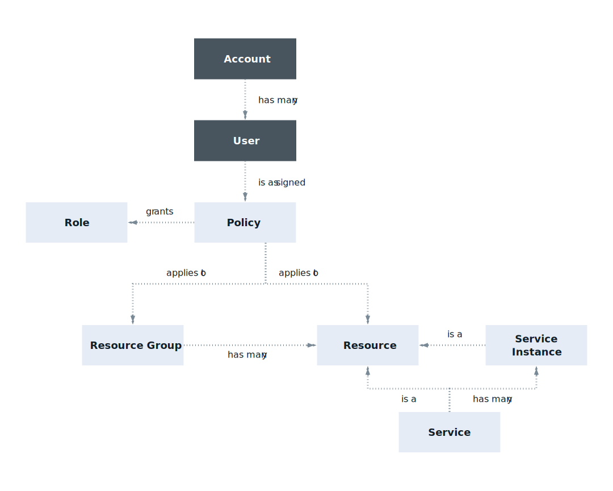

---

copyright:

  years: 2017, 2018

lastupdated: "2018-11-30"

---

{:shortdesc: .shortdesc}
{:codeblock: .codeblock}
{:screen: .screen}
{:new_window: target="_blank"}

# {{site.data.keyword.Bluemix_notm}} Identity and Access Management
{: #iamoverview}

## What is Cloud IAM?

{{site.data.keyword.Bluemix_notm}} Identity and Access Management (IAM) enables you to securely authenticate users for both platform services and control access to resources consistently across {{site.data.keyword.Bluemix_notm}}. A set of {{site.data.keyword.Bluemix_notm}} services are enabled to use Cloud IAM for access control and are organized into [resource groups](/docs/account/resourcegroups.html) within your account to enable giving users quick and easy access to more than one resource at a time. Cloud IAM access policies are used to assign users and service IDs access to the resources within your account. You can group users and service IDs into an [access group](/docs/iam/groups.html) to easily give all entities within the group the same level of access.

A policy assigns a subject, which is a user, [service ID](/docs/iam/serviceid.html#serviceids), or access group, one or more roles with a combination of attributes that define the scope of access to a target. The policy can provide access to a single service down to the instance level, to a set of resources organized together in a resource group, or to account management services. Depending on the [IAM roles](/docs/iam/users_roles.html#iamusermanrol) that you assign, the subject is allowed varying levels of access for completing account management tasks, working with service instances, or accessing a service by using the UI or completing API calls.

For services that do not support creating Cloud IAM policies for managing access, you can use [Cloud Foundry access](/docs/iam/cfaccess.html#cfaccess) or [Classic infrastructure permissions](/docs/iam/infrastructureaccess.html#infrapermission).

## What features does Cloud IAM provide?
{: #features}

<dl>
<dt>User management</dt>
<dd>Unified user management enables you to add and delete users in an account for both platform and classic infrastructure services. You can organize a group of users in an access group to make assigning access for more than one user at a time a quick and easy task.</dd>
<dt>Fine-grained access control</dt>
<dd>Access for users, service IDs, and access groups is defined by a policy. Within the policy, the scope of access for a user, service ID, or access group can be assigned to a set of resources in a resource group, a single resource, or account management services. After the scope is set, you can define what actions are allowed by the subject of the policy by selecting access roles. Roles provide a way to tailor the level of access that is granted for the subject of the policy to perform actions on the target of policy, whether it is platform management tasks within the account or accessing a service's UI or completing API calls.</dd>
<dt>API keys for user authentication</dt>
<dd>Multiple API keys can be created for a user to support key rotation scenarios, and the same key can be used for accessing multiple services. {{site.data.keyword.cloud_notm}} API keys enable users who use two-factor authentication or a federated ID to automate authentication to the console from the command line. A user can also have a single classic infrastructure API key that can be used to access classic infrastructure APIs; however, this is not required as you can use {{site.data.keyword.cloud_notm}} API keys to access the same APIs.</dd>
<dt>Service IDs</dt>
<dd>A service ID identifies a service or application similar to how a user ID identifies a user. These are IDs that can be used by applications to authenticate with an {{site.data.keyword.Bluemix_notm}} service. Policies can be assigned to each service ID to control the level of access that is allowed by an application that uses the service ID, and an API key can be created to enable the authentication.</dd>
</dl>

## How do I use Cloud IAM?

You can access and use Cloud IAM through the Access (IAM) UI, CLI, or API.

* To access Cloud IAM by using the UI, go to **Manage** &gt; **Access (IAM)**.
* Go to [Managing IAM access, API keys, service IDs, and access groups](/docs/cli/reference/ibmcloud/cli_api_policy.html#ibmcloud_commands_iam) to review the available CLI commands.
* Go to the following API docs to review the available APIs:
    * [IAM Identity Services API](https://{DomainName}/apidocs/iam-identity-token-api){: new_window} 
    * [IAM Access Groups API](https://{DomainName}/apidocs/iam-access-groups){: new_window} 
    * [IAM Policy Management API](https://{DomainName}/apidocs/iam-policy-management){: new_window} 
