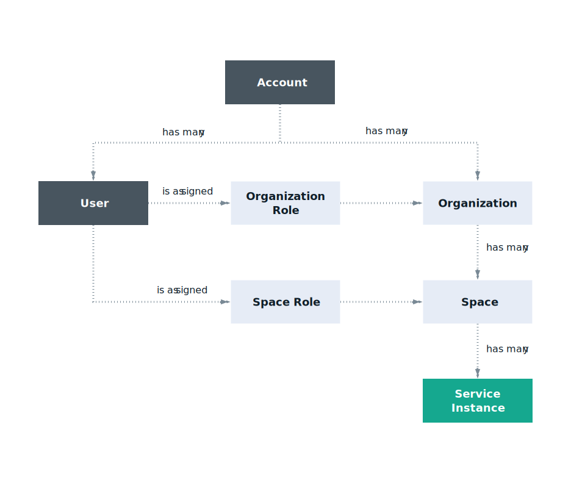

---

copyright:

  years: 2017, 2018

lastupdated: "2018-11-12"

---

{:shortdesc: .shortdesc}
{:codeblock: .codeblock}
{:screen: .screen}
{:new_window: target="_blank"}
{:tip: .tip}
{:note: .note}

# Cloud Foundry-Zugriff
{: #cfaccess}

Derzeit können nicht alle Services unter Verwendung von Cloud IAM verwaltet werden. Sie können Cloud Foundry-Rollen weiterhin für den Zugriff auf diese Serviceinstanzen verwenden. Benutzer werden zu der Organisation und zu dem Bereich hinzugefügt, zu der bzw. dem die Instanz gehört. Dazu wird eine Cloud Foundry-Rolle zugewiesen. 
{:shortdesc}

## Cloud Foundry-Rollen
{: #cfroles}

Cloud Foundry-Rollen gewähren Zugriff für Organisationen und Bereiche innerhalb des Kontos. Cloud Foundry-Rollen aktivieren keine Benutzerberechtigungen zum Ausführen von Aktionen im Kontext eines Service innerhalb des gesamten Kontos.

Die folgenden Rollen können auf Organisationsebene hinzugefügt werden:

| Organisationsrolle | Berechtigungen |
|-------------------|-------------|
|Manager | Organisationsmanager können Bereiche innerhalb der Organisation erstellen, anzeigen, bearbeiten oder löschen, die Nutzung und das Kontingent der Organisation anzeigen, Benutzer zur Organisation einladen, steuern, wer Zugriff auf die Organisation und die Rollen in der Organisation hat, und die angepassten Domänen für die Organisation verwalten. |
|Abrechnungsmanager | Abrechnungsmanager können Informationen zur Laufzeit- und Servicenutzung für die Organisation auf der Seite 'Nutzungsdashboard' anzeigen.  |
|Auditor | Organisationsauditoren können Anwendungs- und Serviceinhalte in der Organisation anzeigen. Auditoren können die Benutzer in der Organisation und deren zugeordnete Rollen sowie das Kontingent für die Organisation auch anzeigen. |
{:caption="Tabelle 1. Organisationsrollen und Berechtigungen" caption-side="top"}

Die folgenden Rollen können auf Bereichsebene zugeordnet werden:

| Bereichsrolle | Berechtigungen |
|------------|-------------|
|Manager | Bereichsmanager können vorhandene Benutzer hinzufügen und Rollen innerhalb des Bereichs verwalten. Der Bereichsmanager kann auch die Anzahl der Instanzen, die Servicebindungen und die Nutzung der Ressource für jede Anwendung im Bereich anzeigen. |
|Entwickler | Bereichsentwickler können Anwendungen und Services innerhalb des Bereichs erstellen, löschen und verwalten. Einige der Verwaltungstasks umfassen das Bereitstellen, Starten oder Stoppen von Apps, das Umbenennen oder Löschen von Apps, das Umbenennen eines Bereichs, das Binden oder Aufheben der Bindung eines Service an eine Anwendung, das Anzeigen der Anzahl der Instanzen, Servicebindungen und der Ressourcennutzung für jede Anwendung im Bereich. Darüber hinaus kann der Bereichsentwickler eine interne oder externe URL einer Anwendung im Bereich zuordnen.   |
|Auditor | Bereichsauditoren haben Lesezugriff auf alle Informationen zu Bereichen, beispielsweise auf Informationen zur Anzahl der Instanzen, zu Servicebindungen und zur Ressourcennutzung für jede Anwendung im Bereich. |
{:caption="Tabelle 2. Bereichsrollen und Berechtigungen" caption-side="top"}

Benutzer, denen die Rolle des Bereichsmanagers oder Bereichsentwicklers zugewiesen wurde, können auf die Umgebungsvariable VCAP_SERVICES zugreifen. Ein Benutzer, dem die Auditorrolle zugewiesen ist, hat jedoch keinen Zugriff auf VCAP_SERVICES.
{: note}
