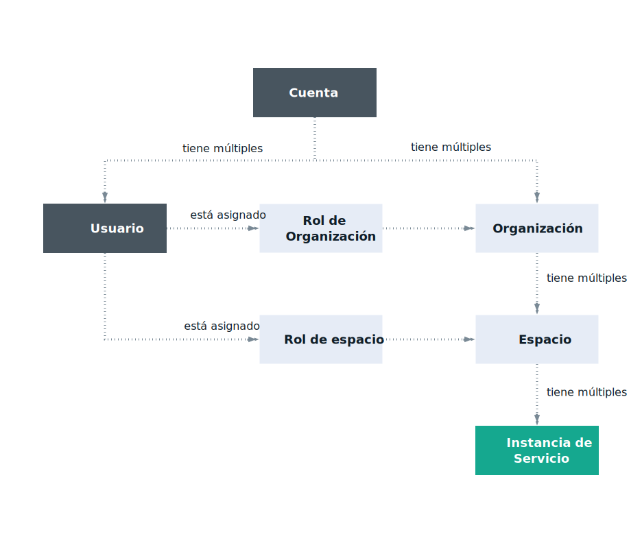

---

copyright:

  years: 2017, 2018

lastupdated: "2018-04-12"

---

{:shortdesc: .shortdesc}
{:codeblock: .codeblock}
{:screen: .screen}
{:new_window: target="_blank"}

# Acceso de Cloud Foundry
{: #cfaccess}

Actualmente, no todos los servicios se pueden gestionar utilizando Cloud IAM. Puede seguir utilizando los roles de Cloud Foundry para acceder a estas instancias de servicio. Los usuarios se añaden a la organización y el espacio a los que pertenece la instancia, con un rol de Cloud Foundry asignado. 

## Roles de Cloud Foundry
{: #cfroles}

Los roles de Cloud Foundry otorgan acceso a las organizaciones y espacios dentro de la cuenta. Los roles de Cloud Foundry no habilitan permisos de usuario para completar acciones dentro del contexto de un servicio en la cuenta.

Los siguientes roles se pueden asignar a nivel de organización:

| Rol de organización | Permisos |
|-------------------|-------------|
|Gestor | Los gestores de organización pueden crear, ver, editar o suprimir espacios dentro de la organización, ver la cuota y el uso de la organización, invitar a usuarios a la organización, gestionar quién tiene acceso a la organización y sus roles en la organización, y gestionar dominios personalizados para la organización. |
|Gestor de facturación | Los gestores de facturación pueden ver la información de uso de tiempo de ejecución y servicio para la organización de la página Panel de control de uso.  |
|Auditor | Los auditores de organización pueden ver el contenido de aplicación y servicio en la organización. Los auditores también pueden ver los usuarios de la organización y sus roles asignados, y la cuota para la organización. |
{:caption="Tabla 1. Permisos y roles de organización" caption-side="top"}

Los siguientes roles se pueden asignar a nivel de espacio:

| Rol de espacio | Permisos |
|------------|-------------|
|Gestor | Los gestores de espacios pueden añadir usuarios existentes y gestionar roles dentro del espacio. Los gestores de espacios también pueden ver el número de instancias, enlaces de servicio y uso de recursos para cada aplicación en el espacio. |
|Desarrollador | Los desarrolladores de espacios pueden crear, suprimir y gestionar aplicaciones y servicios dentro del espacio. Algunas de las tareas de gestión incluyen el desarrollo de apps, el inicio o la detención de apps, el cambio de nombre de una app, la supresión de una app, el enlace o desenlace de un servicio con una aplicación, ver el número o instancias, enlaces de servicio y uso de recursos para cada aplicación en el espacio. Además, el desarrollador de espacios puede asociar un URL interno o externo con una aplicación en el espacio.   |
|Auditor | Los auditores del espacio tienen acceso de solo lectura a toda la información sobre el espacio, como la información sobre el número de instancias, enlaces de servicio y uso de recursos para cada aplicación en el espacio. |
{:caption="Tabla 2. Permisos y roles de espacio" caption-side="top"}

**Nota**: Los usuarios que tienen asignado el rol de espacio de gestor o desarrollador pueden acceder a la variable de entorno VCAP_SERVICES. Sin embargo, un usuario que tienen asignado el rol de auditor no puede acceder a VCAP_SERVICES.
