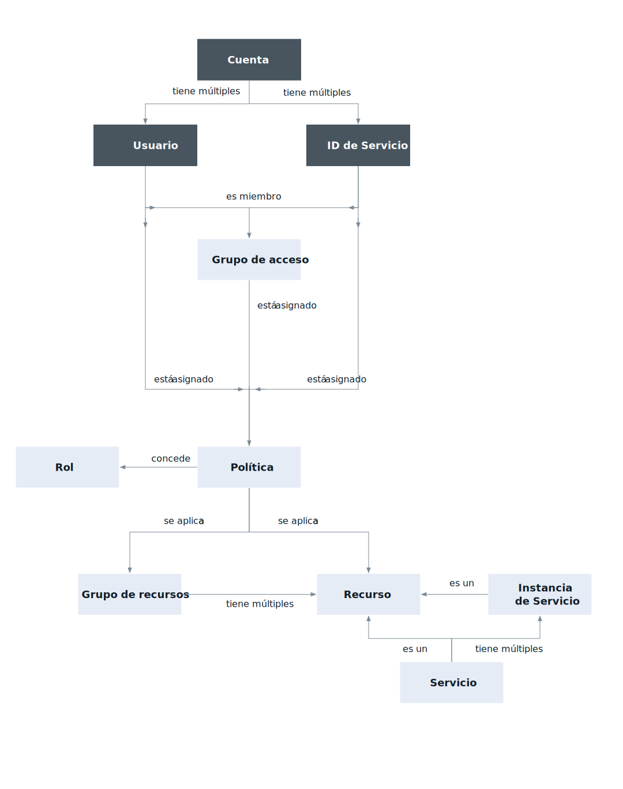

---

copyright:

  years: 2017, 2018

lastupdated: "2018-11-30"

---

{:shortdesc: .shortdesc}
{:codeblock: .codeblock}
{:screen: .screen}
{:new_window: target="_blank"}

# Gestión de identidad y acceso de {{site.data.keyword.Bluemix_notm}}
{: #iamoverview}

## ¿Qué es Cloud IAM?

La Gestión de identidad y acceso de {{site.data.keyword.Bluemix_notm}} (IAM) le permite autenticar usuarios de forma segura en los servicios de plataforma y controlar el acceso a los recursos de forma coherente en {{site.data.keyword.Bluemix_notm}}. Hay un conjunto de servicios de {{site.data.keyword.Bluemix_notm}} habilitados para utilizar Cloud IAM para controlar el acceso y están organizados en [grupos de recursos](/docs/account/resourcegroups.html) dentro de su cuenta para poder proporcionar a los usuarios un acceso rápido y fácil a más de un recurso a la vez. Las políticas de acceso de Cloud IAM se utilizan para asignar accesos de usuario e ID de servicio a los recursos de su cuenta. Puede agrupar usuarios e ID de servicio en un [grupo de acceso](/docs/iam/groups.html) para proporcionar el mismo nivel de acceso a todas las entidades del grupo.

Una política asigna a un sujeto, que es un usuario, un [ID de servicio](/docs/iam/serviceid.html#serviceids), o grupo de acceso, uno o varios roles con una combinación de atributos que definen el ámbito de acceso a un destino. La política puede proporcionar acceso a un único servicio a nivel de instancia, a un conjunto de recursos organizados en un grupo de recursos o a servicios de gestión de cuentas. En función de los [roles de IAM](/docs/iam/users_roles.html#iamusermanrol) que asigne, se permite al sujeto distintos niveles de acceso para completar tareas de gestión de cuentas, trabajar con instancias de servicio o acceder a un servicio utilizando la interfaz de usuario o completando llamadas de API.

Para los servicios que no permite la creación de políticas IAM de nube para gestionar el acceso, puede utilizar el [acceso de Cloud Foundry](/docs/iam/cfaccess.html#cfaccess) o los [permisos de la infraestructura clásica](/docs/iam/infrastructureaccess.html#infrapermission).

## ¿Qué características proporciona Cloud IAM?
{: #features}

<dl>
<dt>Gestión de usuarios</dt>
<dd>La gestión de usuarios unificada le permite añadir y suprimir usuarios en una cuenta para servicios tanto de la plataforma como de la infraestructura clásica. Puede organizar un grupo de usuarios en un grupo de acceso para hacer que la tarea de asignar accesos a más de un usuario sea rápida y sencilla.</dd>
<dt>Control de acceso preciso</dt>
<dd>El acceso para usuarios, ID de servicio y grupos de acceso se define mediante una política. Dentro de la política, el ámbito del acceso para un usuario, ID de servicio o grupo de acceso se puede asignar a un conjunto de recursos de un grupo de recursos, a un único recurso o a servicios de gestión de la cuenta. Después de definir el ámbito, puede definir qué acciones están permitidas por el sujeto de la política seleccionando roles de acceso. Los roles proporcionan una forma de adaptar el nivel de acceso otorgado al sujeto de la política para realizar acciones sobre el destino de la política, ya sea tareas de gestión de la plataforma dentro de la cuenta, acceso a la IU de un servicio o realización de llamadas de API.</dd>
<dt>Claves de API para la autenticación de usuario</dt>
<dd>Se pueden crear varias claves de API para que un usuario soporte escenarios de rotación de claves, y se puede utilizar la misma clave para acceder a varios servicios. Las claves de API de {{site.data.keyword.cloud_notm}} permiten a los usuarios que utilizan la autenticación de dos factores o un ID federado automatizar la autenticación a la consola desde la línea de mandatos. Un usuario también puede tener una sola clave de API de la infraestructura clásica que se puede utilizar para acceder a las API de la infraestructura clásica; sin embargo, esto no es necesario, ya que puede utilizar las claves de API de {{site.data.keyword.cloud_notm}} para acceder a las mismas API.</dd>
<dt>ID de servicio</dt>
<dd>Un ID de servicio identifica un servicio o una aplicación de forma similar a cómo un ID de usuario identifica un usuario. Estos son identificadores que pueden utilizar las aplicaciones para autenticarse con un servicio de {{site.data.keyword.Bluemix_notm}}. Las políticas se pueden asignar a cada ID de servicio para controlar el nivel de acceso permitido por una aplicación que utiliza el ID de servicio, y se puede crear una clave de API para habilitar la autenticación.</dd>
</dl>

## ¿Cómo utilizo Cloud IAM?

Puede acceder y utilizar Cloud IAM a través de la interfaz de usuario de Acceso (IAM), la CLI o la API.

* Para acceder a Cloud IAM utilizando la interfaz de usuario, vaya a **Gestionar** &gt; **Acceso (IAM)**.
* Vaya a [Gestión de acceso de IAM, claves de API, ID de servicio y grupos de acceso](/docs/cli/reference/ibmcloud/cli_api_policy.html#ibmcloud_commands_iam) para ver los mandatos de CLI disponibles.
* Consulte la siguiente documentación sobre API para ver las API disponibles:
    * [API de servicios de identidad de IAM](https://{DomainName}/apidocs/iam-identity-token-api){: new_window} 
    * [API de grupos de acceso de IAM](https://{DomainName}/apidocs/iam-access-groups){: new_window} 
    * [API de gestión de políticas de IAM](https://{DomainName}/apidocs/iam-policy-management){: new_window} 
