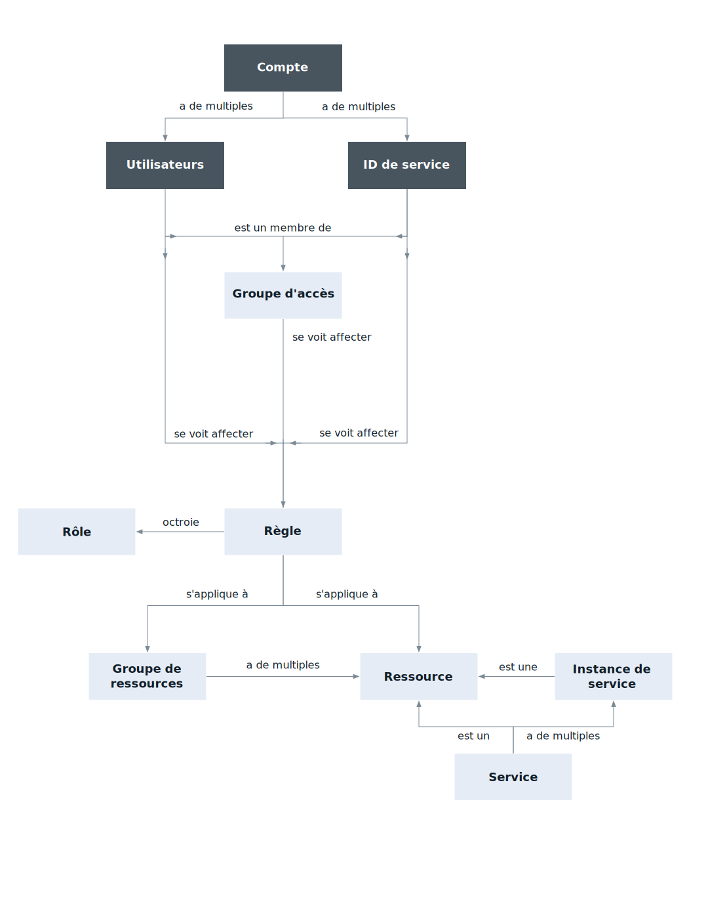

---

copyright:

  years: 2017, 2018

lastupdated: "2018-11-30"

---

{:shortdesc: .shortdesc}
{:codeblock: .codeblock}
{:screen: .screen}
{:new_window: target="_blank"}

# {{site.data.keyword.Bluemix_notm}} Identity and Access Management
{: #iamoverview}

## Qu'est-ce que Cloud IAM ?

{{site.data.keyword.Bluemix_notm}} Identity and Access Management (IAM) vous permet d'authentifier de manière sécurisée les utilisateurs des services de plateforme et de contrôler de façon cohérente l'accès aux ressources dans {{site.data.keyword.Bluemix_notm}}. Un ensemble de services {{site.data.keyword.Bluemix_notm}} sont activés pour utiliser Cloud IAM afin de contrôler les accès. Ils sont organisés en [groupes de ressources](/docs/account/resourcegroups.html) dans votre compte pour offrir à des utilisateurs sélectionnés un accès rapide et facile à plusieurs ressources à la fois. Des règles d'accès Cloud IAM permettent d'affecter à des ID utilisateur et de service un accès aux ressources de votre compte. Vous pouvez regrouper des utilisateurs et des ID de service dans un [groupe d'accès](/docs/iam/groups.html) pour accorder facilement le même niveau d'accès à toutes les entités du groupe.

Une règle affecte à un objet (à savoir un utilisateur, un [ID de service](/docs/iam/serviceid.html#serviceids) ou un groupe d'accès), un ou plusieurs rôles avec une combinaison d'attributs qui définissent la portée de l'accès sur une cible. La règle peut fournir un accès à un seul service, jusqu'au niveau instance, à un ensemble de ressources organisées dans un groupe de ressources, ou encore à des services de gestion de compte. Selon les [rôles IAM](/docs/iam/users_roles.html#iamusermanrol) que vous affectez, différents niveaux d'accès sont octroyés à l'objet pour lui permettre de réaliser diverses tâches de gestion de compte, d'utiliser des instances de service ou d'accéder à un service via l'interface utilisateur ou des appels d'API.

Concernant les services qui ne prennent pas en charge la création de règles Cloud IAM pour la gestion de l'accès, vous pouvez utiliser l'[accès Cloud Foundry](/docs/iam/cfaccess.html#cfaccess) ou les [droits d'infrastructure classique](/docs/iam/infrastructureaccess.html#infrapermission).

## Fonctions fournies par Cloud IAM
{: #features}

<dl>
<dt>Gestion des utilisateurs</dt>
<dd>Gestion unifiée des utilisateurs qui vous permet d'ajouter et de supprimer des utilisateurs dans un compte à la fois pour les services de plateforme et d'infrastructure classique. Vous pouvez organiser un groupe d'utilisateurs dans un groupe d'accès pour faciliter et accélérer l'affectation d'accès à plusieurs utilisateurs à la fois.</dd>
<dt>Contrôle d'accès à granularité fine</dt>
<dd>L'accès pour les utilisateurs, les ID de service et les groupes d'accès est défini par une règle. Au sein de la règle, la portée d'accès pour un utilisateur, un ID de service ou un groupe d'accès peut être défini sur un ensemble de ressources dans un groupe de ressources, sur une ressource unique ou sur des services de gestion de compte. Une fois la portée spécifiée, vous pouvez définir les actions autorisées par l'objet de la règle en sélectionnant des rôles d'accès. Les rôles sont un moyen de personnaliser le niveau d'accès accordé à l'objet de la règle afin d'effectuer des tâches sur la cible de la règle, qu'il s'agisse de tâches de gestion de plateforme dans le compte, d'accéder à l'interface utilisateur d'un service ou d'émettre des appels API.</dd>
<dt>Clés d'API pour l'authentification d'utilisateur</dt>
<dd>Vous pouvez créer plusieurs clés d'API pour qu'un utilisateur prenne en charge des scénarios de rotation des clés et que la même clé puisse être utilisée pour l'accès à plusieurs services. Les clés d'API {{site.data.keyword.cloud_notm}} permettent aux utilisateurs qui font appel à l'authentification à deux facteurs ou à un ID fédéré d'automatiser l'authentification auprès de la console à partir de la ligne de commande. Un utilisateur peut également avoir une clé d'API d'infrastructure classique unique pouvant être utilisée pour accéder aux API d'infrastructure classique. Toutefois, elle n'est pas requise car vous pouvez utiliser des clés d'API {{site.data.keyword.cloud_notm}} pour accéder aux mêmes API.</dd>
<dt>ID de service</dt>
<dd>Un ID de service identifie un service ou une application de la même façon qu'un ID utilisateur identifie un utilisateur. Les applications peuvent utiliser ces ID pour s'authentifier auprès d'un service {{site.data.keyword.Bluemix_notm}}. Vous pouvez affecter des règles à chaque ID de service afin de contrôler le niveau d'accès accordé à une application qui utilise l'ID de service et créer une clé d'API qui active l'authentification.</dd>
</dl>

## Comment utiliser Cloud IAM ?

Vous pouvez accéder à Cloud IAM via l'API, l'interface CLI ou l'interface utilisateur Access (IAM).

* Pour accéder à Cloud IAM en utilisant l'interface utilisateur, sélectionnez **Gérer** &gt; **Accès (IAM)**.
* Pour consulter les commandes de l'interface CLI disponibles, voir [Identité, accès et clés d'API IAM](/docs/cli/reference/ibmcloud/cli_api_policy.html#ibmcloud_commands_iam).
* Pour consulter les API disponibles, voir les pages de documentation suivantes concernant les API :
    * [IAM Identity Services API](https://{DomainName}/apidocs/iam-identity-token-api){: new_window} 
    * [IAM Access Groups API](https://{DomainName}/apidocs/iam-access-groups){: new_window} 
    * [IAM Policy Management API](https://{DomainName}/apidocs/iam-policy-management){: new_window} 
