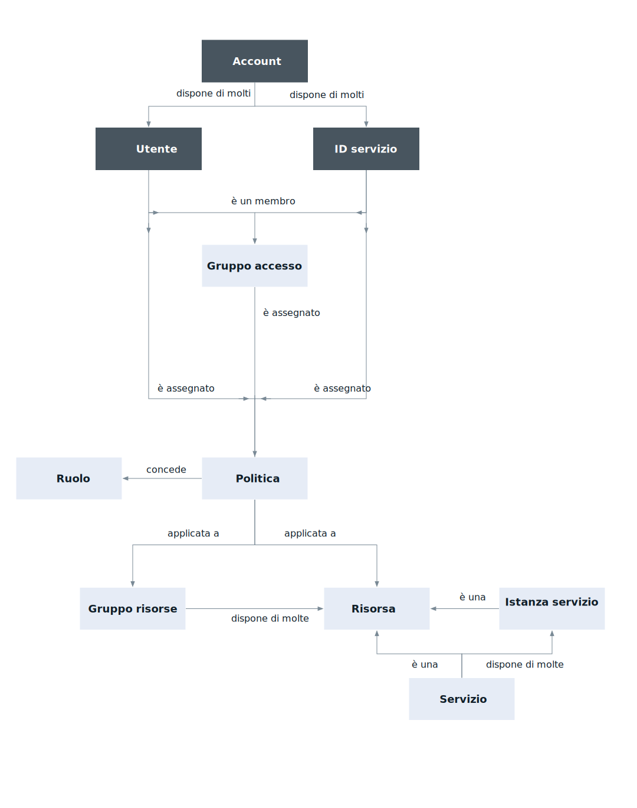

---

copyright:

  years: 2017, 2018

lastupdated: "2018-04-05"

---

{:shortdesc: .shortdesc}
{:codeblock: .codeblock}
{:screen: .screen}
{:new_window: target="_blank"}

# {{site.data.keyword.Bluemix_notm}} Identity and Access Management
{: #iamoverview}

## Cos'è Cloud IAM?

{{site.data.keyword.Bluemix_notm}} Identity and Access Management (IAM) ti consente di autenticare in modo sicuro gli utenti per i servizi di piattaforma e controllare l'accesso alle risorse in modo coerente attraverso la piattaforma {{site.data.keyword.Bluemix_notm}}. Un insieme di servizi {{site.data.keyword.Bluemix_notm}} è abilitato per utilizzare Cloud IAM per il controllo dell'accesso e questi servizi sono organizzati in [gruppi di risorse](/docs/account/resourcegroups.html) all'interno del tuo account per consentire agli utenti un accesso rapido e semplice a più di una risorsa alla volta. Le politiche di accesso Cloud IAM vengono utilizzate per assegnare agli utenti e agli ID servizio l'accesso alle risorse all'interno del tuo account. Puoi raggruppare una serie di utenti e ID del servizio in un [gruppo di accesso](/docs/iam/groups.html) per fornire facilmente a tutte le entità nel gruppo lo stesso livello di accesso.

Una politica assegna a un utente o a un [ID servizio](/docs/iam/serviceid.html#serviceids) uno o più ruoli con una combinazione di attributi che definiscono l'ambito di accesso. La politica può fornire l'accesso a un singolo servizio fino al livello di istanza o può essere applicata a un insieme di risorse organizzate insieme in un gruppo di risorse. A seconda dei [ruoli utente](/docs/iam/users_roles.html#iamusermanrol) che assegni, all'utente o all'ID servizio vengono consentiti diversi livelli di accesso per completare attività di gestione della piattaforma o per accedere a un servizio utilizzando l'interfaccia utente o eseguire specifici tipi di chiamate API.

Per i servizi che non supportano la creazione di politiche Cloud IAM per la gestione dell'accesso, puoi utilizzare [Accesso Cloud Foundry](/docs/iam/cfaccess.html#cfaccess).

## Quali funzioni sono fornite da Cloud IAM?
{: #features}

<dl>
<dt>Gestione utenti</dt>
<dd>La gestione utenti unificata ti consente di aggiungere ed eliminare gli utenti in un account per i servizi di piattaforma e infrastruttura. Puoi creare un gruppo di utenti denominato gruppo di accesso per rendere l'assegnazione dell'accesso a più di un utente alla volta un'attività più facile e veloce.</dd>
<dt>Controllo dell'accesso dettagliato</dt>
<dd>L'accesso per gli utenti e gli ID servizio è definito da una politica. All'interno della politica, l'ambito di accesso di un utente, un ID del servizio o di un gruppo di accesso può essere assegnato a un insieme di risorse in un gruppo di risorse o a una singola risorsa. Dopo aver impostato l'ambito, puoi definire quali azioni sono consentite dall'oggetto della politica selezionando i ruoli di accesso. I ruoli forniscono un modo per personalizzare il livello di accesso concesso per l'oggetto della politica per eseguire attività di gestione della piattaforma e accedere all'interfaccia utente di un servizio o eseguire chiamate API.</dd>
<dt>Chiavi API per l'autenticazione dell'utente</dt>
<dd>È possibile creare più chiavi API per utente per supportare gli scenari di rotazione della chiave e la stessa chiave può essere utilizzata per accedere a più servizi. Le chiavi API dell'utente della piattaforma consentono agli utenti che utilizzano l'autenticazione a due fattori o un ID federato di automatizzare l'autenticazione dalla riga di comando.</dd>
<dt>ID servizio</dt>
<dd>Un ID servizio identifica un servizio o un'applicazione analogamente a come un ID utente identifica un utente. Questi sono ID che possono essere utilizzati dalle applicazioni per l'autenticazione con un servizio {{site.data.keyword.Bluemix_notm}}. È possibile assegnare le politiche a ciascun ID servizio per controllare il livello di accesso consentito da un'applicazione che utilizza l'ID servizio ed è possibile creare una chiave API per abilitare l'autenticazione.</dd>
</dl>

## Come posso utilizzare Cloud IAM?

Puoi accedere e utilizzare Cloud IAM attraverso l'interfaccia utente di Identità e accesso o la CLI di {{site.data.keyword.Bluemix_notm}}.

Per accedere a Cloud IAM utilizzando l'interfaccia utente, vai a **Gestisci** &gt; **Sicurezza** &gt; **Identità e accesso**.

Per accedere a Cloud IAM utilizzando la CLI, fai riferimento a [Comandi per gestire le politiche e le chiavi API](/docs/cli/reference/bluemix_cli/bx_cli.html#bx_commands_iam).
