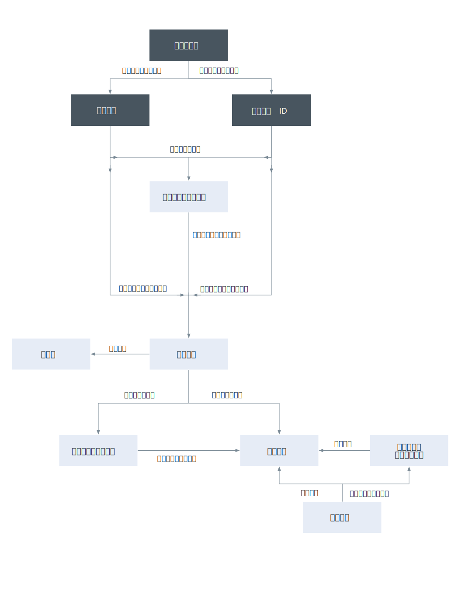

---

copyright:

  years: 2017, 2018

lastupdated: "2018-10-30"

---

{:shortdesc: .shortdesc}
{:codeblock: .codeblock}
{:screen: .screen}
{:new_window: target="_blank"}

# {{site.data.keyword.Bluemix_notm}} Identity and Access Management
{: #iamoverview}

## Cloud IAM とは?

{{site.data.keyword.Bluemix_notm}} Identity and Access Management (IAM) を使用すると、プラットフォーム・サービスに関してユーザーをセキュアに認証でき、また {{site.data.keyword.Bluemix_notm}} プラットフォーム全体で一貫してリソースへのアクセスを制御できます。 一連の {{site.data.keyword.Bluemix_notm}} サービスでは、アクセス制御に Cloud IAM の使用が有効になっています。また、アカウント内で複数の[リソース・グループ](/docs/account/resourcegroups.html)に編成されており、ユーザーは一度に複数のリソースに素早く簡単にアクセスすることができます。ご使用のアカウント内のリソースへのアクセス権限をユーザーおよびサービス ID に割り当てるために、Cloud IAM アクセス・ポリシーが使用されます。 ユーザーとサービス ID のセットを[アクセス・グループ](/docs/iam/groups.html)にグループ化して、そのグループ内のすべてのエンティティーに同じレベルのアクセス権限を簡単に付与することができます。

ポリシーは、サブジェクト (すなわちユーザー、[サービス ID](/docs/iam/serviceid.html#serviceids)、またはアクセス・グループ) に、ターゲットへのアクセス権限の有効範囲を定義する属性の組み合わせを持つ 1 つ以上の役割を割り当てます。ポリシーは、単一サービスへのアクセス権限を、インスタンス・レベル、リソース・グループに編成された一連のリソース、またはアカウント管理サービスに至るまで付与できます。割り当てられる [IAM 役割](/docs/iam/users_roles.html#iamusermanrol)に応じて、サブジェクトは、アカウント管理タスクを実行したり、サービス・インスタンスを処理したり、または UI の使用や API 呼び出しの実行によってサービスにアクセスしたりするためのさまざまなレベルのアクセス権限を許可されます。

アクセス管理のための Cloud IAM ポリシーの作成をサポートしていないサービスには、[Cloud Foundry アクセス権限](/docs/iam/cfaccess.html#cfaccess)を使用できます。

## Cloud IAM の機能にはどのようなものがありますか?
{: #features}

<dl>
<dt>ユーザー管理</dt>
<dd>一元化されたユーザー管理により、プラットフォーム・サービスおよびインフラストラクチャー・サービスの両方に関して、アカウント内のユーザーを追加したり削除したりすることができます。 一度に複数のユーザーのアクセス権限を割り当てるタスクを素早く簡単に行えるようにするために、アクセス・グループというユーザーのグループを作成することができます。</dd>
<dt>微細化されたアクセス制御</dt>
<dd>ユーザー、サービス ID、およびアクセス・グループのアクセス権限は、ポリシーによって定義されます。ポリシー内で、ユーザー、サービス ID、またはアクセス・グループのアクセス権限の有効範囲は、リソース・グループ内の一連のリソース、単一リソース、またはアカウント管理サービスに割り当てることができます。有効範囲が設定された後、アクセス役割を選択することによって、ポリシーの対象に許可されるアクションを定義できます。 役割は、アカウント内のプラットフォーム管理タスクか、サービスの UI へのアクセスか、API 呼び出しの実行かにかかわらず、ポリシーのサブジェクトがポリシーのターゲットに対してアクションを実行するために付与されるアクセス・レベルを調整する方法を提供します。</dd>
<dt>ユーザー認証のための API キー</dt>
<dd>キー循環シナリオをサポートするために 1 人のユーザー用に複数の API キーを作成でき、同じキーを使用して複数のサービスにアクセスできます。 プラットフォーム・ユーザー API キーは、2 要素認証またはフェデレート ID を使用するユーザーがコマンド・ラインから認証を自動化することを可能にします。</dd>
<dt>サービス ID</dt>
<dd>ユーザー ID がユーザーを識別するのと同様の方法で、サービス ID はサービスまたはアプリケーションを識別します。 これは、{{site.data.keyword.Bluemix_notm}} サービスでの認証のためにアプリケーションで使用できる ID です。 アプリケーションで許可されるアクセス・レベルをサービス ID を使用して制御できるように各サービス ID にポリシーを割り当てることができ、認証を有効にするために API キーを作成することができます。</dd>
</dl>

## Cloud IAM の使用方法は?

「ID およびアクセス」の UI または {{site.data.keyword.Bluemix_notm}} の CLI を介して、Cloud IAM にアクセスし、Cloud IAM を使用することができます。

UI を使用して Cloud IAM にアクセスするには、**「管理」** &gt; **「セキュリティー」** &gt; **「ID およびアクセス」**と進みます。

CLI を使用して Cloud IAM にアクセスする方法については、[API キーとポリシーを管理するためのコマンド](/docs/cli/reference/ibmcloud/cli_api_policy.html#ibmcloud_commands_iam)を参照してください。
