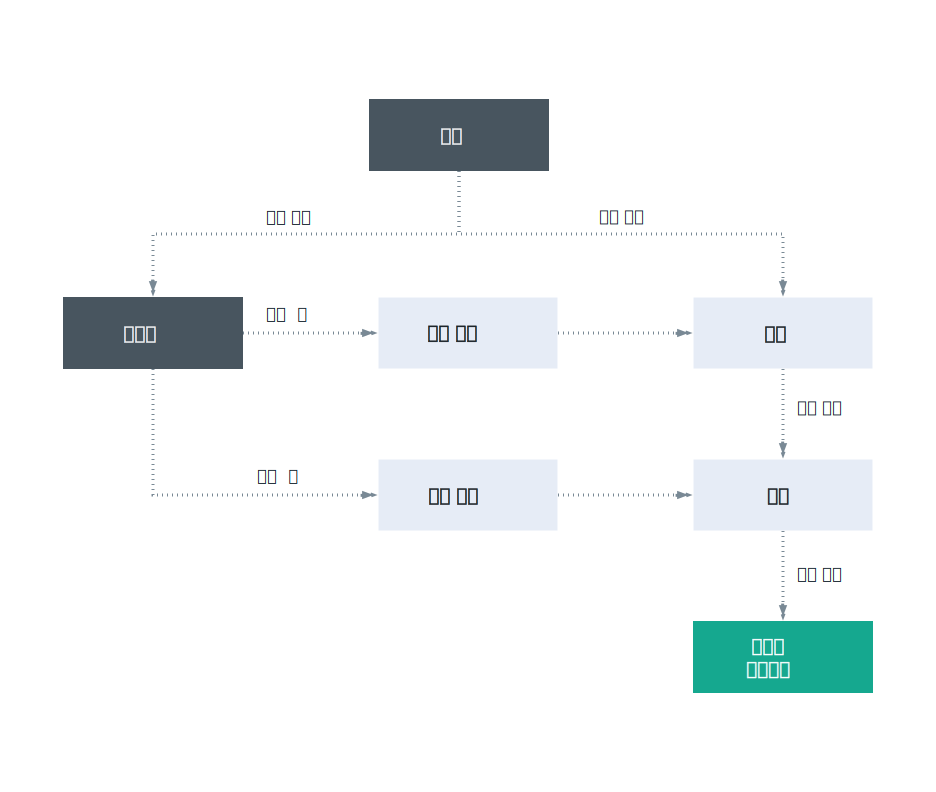

---

copyright:

  years: 2017, 2018

lastupdated: "2018-11-12"

---

{:shortdesc: .shortdesc}
{:codeblock: .codeblock}
{:screen: .screen}
{:new_window: target="_blank"}
{:tip: .tip}
{:note: .note}

# Cloud Foundry 액세스
{: #cfaccess}

현재는 Cloud IAM을 사용하여 모든 서비스를 관리할 수는 없습니다. 이러한 서비스 인스턴스에 대한 액세스를 위해 Cloud Foundry 역할을 계속 사용할 수 있습니다. 사용자는 Cloud Foundry 역할이 지정된 상태에서 인스턴스가 속한 조직과 영역에 추가됩니다. 
{:shortdesc}

## Cloud Foundry 역할
{: #cfroles}

Cloud Foundry 역할은 계정 내의 조직과 영역에 대한 액세스를 부여합니다. Cloud Foundry 역할은 사용자 권한을 사용하여 계정에서 서비스의 컨텍스트 내의 조치를 완료하지 않습니다.

조직 레벨에서 지정할 수 있는 역할은 다음과 같습니다.

|조직 역할 |권한 |
|-------------------|-------------|
|관리자 |조직 관리자는 조직 내에서 영역을 작성하거나, 편집하거나, 삭제하거나 볼 수 있으며, 조직의 사용량 및 할당량을 보고, 사용자를 조직에 초대하고, 조직에 액세스할 수 있는 사용자 및 해당 사용자의 조직 내 역할을 관리하고 조직에 대한 사용자 정의 도메인을 관리할 수 있습니다. |
|청구 관리자 |청구 관리자는 사용량 대시보드 페이지에서 조직의 런타임 및 서비스 사용량 정보를 볼 수 있습니다.  |
|감사자 |조직 감사자는 조직에 있는 애플리케이션 및 서비스 컨텐츠를 볼 수 있습니다. 또한 감사자는 조직의 사용자와 지정된 역할 및 조직에 대한 할당량을 볼 수 있습니다. |
{:caption="표 1. 조직 역할 및 권한" caption-side="top"}

영역 레벨에서 지정할 수 있는 역할은 다음과 같습니다.

|영역 역할 |권한 |
|------------|-------------|
|관리자 |영역 관리자는 기존 사용자를 추가하고 영역 내의 역할을 관리할 수 있습니다. 또한 영역 관리자는 영역에 있는 각 애플리케이션에 대한 인스턴스 수, 서비스 바인딩 수 및 리소스 사용 수를 볼 수 있습니다. |
|개발자 |영역 개발자는 영역 내에서 애플리케이션 및 서비스를 작성, 삭제 및 관리할 수 있습니다. 일부 관리 태스크에는 앱 배치, 앱 시작 또는 중지, 앱 이름 바꾸기, 앱 삭제, 영역 이름 바꾸기, 서비스를 애플리케이션에 바인딩 또는 바인딩 해제, 영역에 있는 각 애플리케이션에 대한 인스턴스 수, 서비스 바인딩 수 및 리소스 사용 수 보기가 포함됩니다. 또한 영역 개발자는 내부 또는 외부 URL을 영역에 있는 애플리케이션과 연관시킬 수 있습니다.   |
|감사자 |영역 감사자에게는 영역에 대한 모든 정보(예: 영역에 있는 각 애플리케이션에 대한 인스턴스 수, 서비스 바인딩 수 및 리소스 사용 수에 대한 정보)에 대한 읽기 전용 액세스 권한이 있습니다. |
{:caption="표 2. 영역 역할 및 권한" caption-side="top"}

관리자 또는 개발자 영역 역할이 지정된 사용자는 VCAP_SERVICES 환경 변수에 액세스할 수 있습니다. 그러나 감사자 역할이 지정된 사용자는 VCAP_SERVICES에 액세스할 수 없습니다.
{: note}
