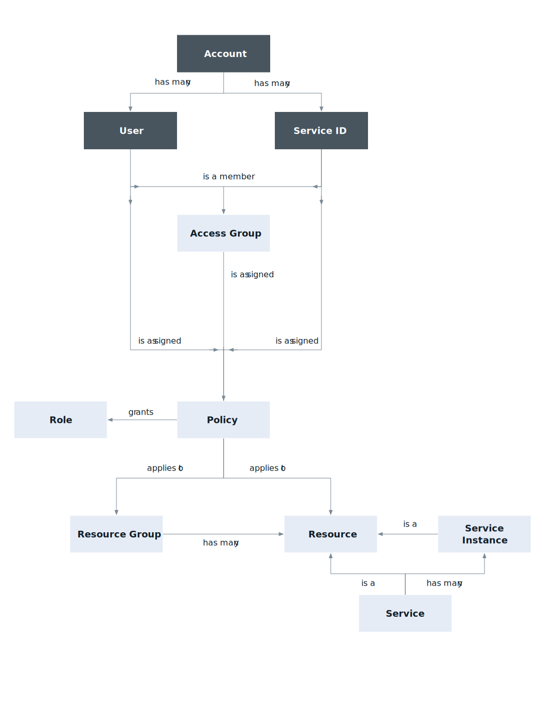

---

copyright:

  years: 2017, 2018

lastupdated: "2018-04-05"

---

{:shortdesc: .shortdesc}
{:codeblock: .codeblock}
{:screen: .screen}
{:new_window: target="_blank"}

# {{site.data.keyword.Bluemix_notm}} Identity and Access Management
{: #iamoverview}

## O que é Cloud IAM?

O {{site.data.keyword.Bluemix_notm}} Identity and Access Management (IAM) permite que você
autentique usuários com segurança para os serviços de plataforma e controle o acesso aos recursos de forma
consistente na plataforma. {{site.data.keyword.Bluemix_notm}} ''''''junto de serviços do {{site.data.keyword.Bluemix_notm}} é ativado para usar o Cloud IAM para controle de acesso e é organizado em [grupos de recursos](/docs/account/resourcegroups.html) dentro de sua conta para permitir que seja fornecido aos usuários acesso rápido e fácil a mais de um recurso de cada vez. As políticas de acesso ao Cloud IAM são usadas para designar aos usuários e IDs de serviço o acesso aos recursos em sua conta. 
É possível agrupar um conjunto de usuários e IDs de serviço em um [grupo de
acesso](/docs/iam/groups.html) para fornecer facilmente o mesmo nível de acesso a todas as entidades dentro do grupo.

Uma política designa a um usuário ou [ID de serviço](/docs/iam/serviceid.html#serviceids) uma ou mais funções com uma combinação de atributos que definem o escopo de acesso. A política pode fornecer acesso a um único serviço até o nível da instância ou a política pode se aplicar a um conjunto de recursos organizados juntos em um grupo de recursos. Dependendo das [funções de usuário](/docs/iam/users_roles.html#iamusermanrol) que você designa, o usuário ou ID de serviço é permitido diferentes níveis de acesso para concluir tarefas de gerenciamento de plataforma ou acessar um serviço usando a UI ou executar tipos específicos de chamadas API.

Para serviços que não suportam a criação de políticas do Cloud IAM para gerenciar acesso, é possível usar o [acesso do Cloud Foundry](/docs/iam/cfaccess.html#cfaccess).

## Quais recursos o Cloud IAM fornece?
{: #features}

<dl>
<dt>Gerenciamento de usuários</dt>
<dd>O gerenciamento de usuários unificado permite que você inclua e exclua usuários em uma conta para serviços de plataforma e infraestrutura. 
É possível criar um grupo de usuários chamado de grupo de acesso para tornar a designação de acesso para mais
de um usuário por vez uma tarefa rápida e fácil.</dd>
<dt>Controle de acesso de baixa granularidade</dt>
<dd>O acesso para usuários e IDs de serviço é definido por uma política. Na política, o escopo de acesso para
um usuário, ID de serviço ou grupo acesso pode ser designado a um conjunto de recursos em um grupo de
recursos ou recurso único. Após o escopo ser configurado, é possível definir quais ações são permitidas pelo assunto da política selecionando as funções de acesso. As funções fornecem uma maneira de customizar o nível de acesso que é concedido para o assunto da política para executar tarefas de gerenciamento de plataforma e acessar a UI de um serviço ou executar chamadas API.</dd>
<dt>Chaves API para autenticação do usuário</dt>
<dd>Múltiplas chaves API podem ser criadas para um usuário para suportar cenários de rotação de chave e a mesma chave pode ser usada para acessar múltiplos serviços. As chaves API do usuário da plataforma permitem que os usuários que usam a autenticação de dois fatores ou um ID federado automatizem a autenticação por meio da linha de comandos.</dd>
<dt>IDs de Serviço</dt>
<dd>Um ID de serviço identifica um serviço ou um aplicativo semelhante a como um ID de usuário identifica um usuário. Estes são os IDs que podem ser usados por aplicativos para autenticar com um serviço do {{site.data.keyword.Bluemix_notm}}. As políticas podem ser designadas a cada ID de serviço para controlar o nível de acesso que é permitido por um aplicativo usando o ID de serviço e uma chave API pode ser criada para ativar a autenticação.</dd>
</dl>

## Como usar o Cloud IAM?

É possível acessar e usar o Cloud IAM por meio da UI do Identity and Access ou da CLI para o {{site.data.keyword.Bluemix_notm}}.

Para acessar o Cloud IAM usando a UI, acesse **Gerenciar** &gt; **Segurança** &gt; **Identity and Access**.

Para acessar o Cloud IAM usando a CLI, consulte [Comandos para gerenciar chaves API e políticas](/docs/cli/reference/bluemix_cli/bx_cli.html#bx_commands_iam).
