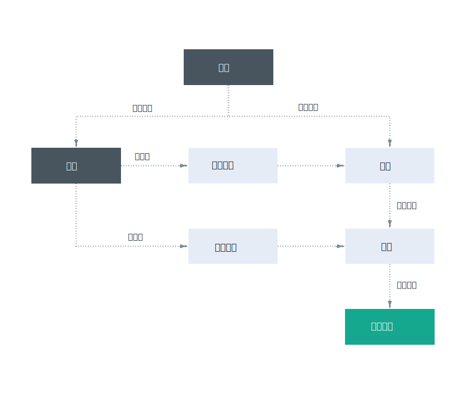

---

copyright:

  years: 2017, 2018

lastupdated: "2018-04-12"

---

{:shortdesc: .shortdesc}
{:codeblock: .codeblock}
{:screen: .screen}
{:new_window: target="_blank"}

# Cloud Foundry 访问权
{: #cfaccess}

目前，并非所有服务都可以使用 Cloud IAM 进行管理。您可以继续使用 Cloud Foundry 角色来访问这些服务实例。用户将添加到实例所属的组织和空间，并分配 Cloud Foundry 角色。 

## Cloud Foundry 角色
{: #cfroles}

Cloud Foundry 角色授予对帐户内组织和空间的访问权。Cloud Foundry 角色不会授予用户在帐户的服务上下文中完成操作的许可权。

可以在组织级别分配以下角色：

|组织角色|许可权|
|-------------------|-------------|
|管理员|组织管理员可以创建、查看、编辑或删除组织内的空间，查看组织的使用情况和配额，邀请用户加入组织，管理谁有权访问组织及其在组织中的角色，以及管理组织的定制域。|
|记帐管理员|记帐管理员可以在“使用情况仪表板”页面上查看组织的运行时和服务使用情况信息。|
|审计员|组织审计员可以查看组织中的应用程序和服务内容。审计员还可以查看组织中的用户及其分配的角色，以及组织的配额。|
{:caption="表 1. 组织角色和许可权" caption-side="top"}

可以在空间级别分配以下角色：

|空间角色|许可权|
|------------|-------------|
|管理员|空间管理员可以添加现有用户，并管理空间内的角色。空间管理员还可以查看空间中每个应用程序的实例数、服务绑定和资源使用情况。|
|开发者|空间开发者可以创建、删除和管理空间内的应用程序和服务。某些管理任务包括部署应用程序，启动或停止应用程序，重命名应用程序，删除应用程序，重命名空间，将服务绑定到应用程序或从应用程序取消绑定服务，以及查看空间中每个应用程序的实例数、服务绑定和资源使用情况。此外，空间开发者还可以将内部或外部 URL 与空间中的应用程序相关联。|
|审计员|空间审计员具有对有关空间的所有信息的只读访问权，例如有关空间中每个应用程序的实例数、服务绑定和资源使用情况的信息。|
{:caption="表 2. 空间角色和许可权" caption-side="top"}

**注**：分配有管理员或开发者空间角色的用户可以访问 VCAP_SERVICES 环境变量。但是，分配有审计员角色的用户无法访问 VCAP_SERVICES。
