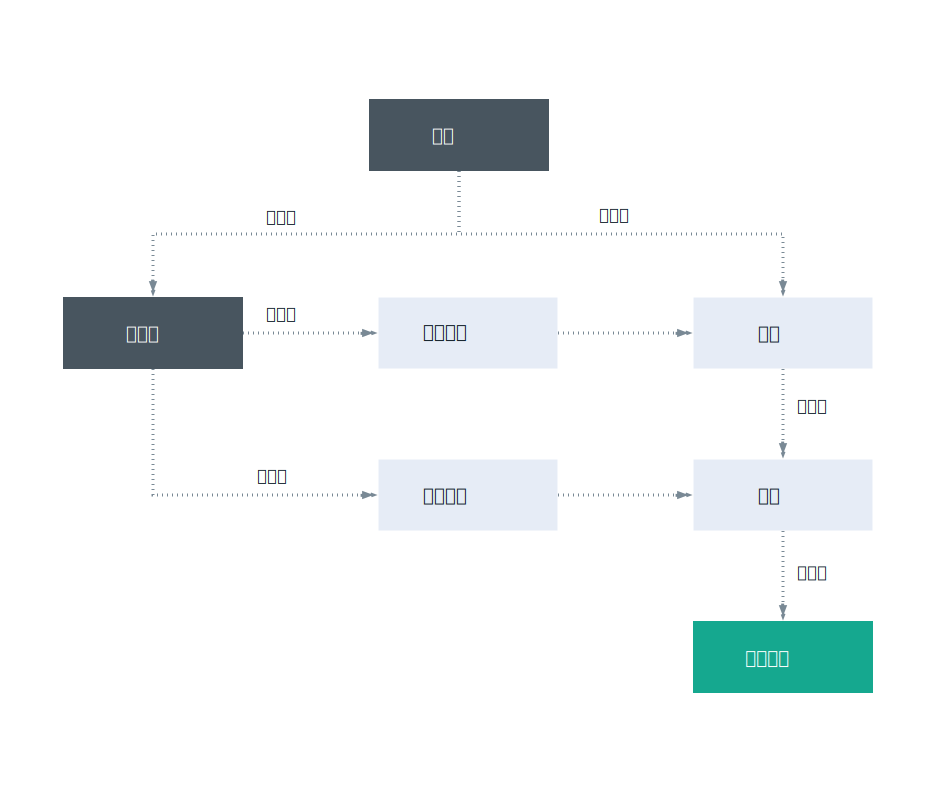

---

copyright:

  years: 2017, 2018

lastupdated: "2018-04-12"

---

{:shortdesc: .shortdesc}
{:codeblock: .codeblock}
{:screen: .screen}
{:new_window: target="_blank"}

# Cloud Foundry 存取
{: #cfaccess}

目前，並非所有服務都可以使用 Cloud IAM 來管理。您可以繼續使用 Cloud Foundry 角色來存取這些服務實例。使用者會新增至實例所屬的組織及空間，並獲得指派 Cloud Foundry 角色。 

## Cloud Foundry 角色
{: #cfroles}

Cloud Foundry 角色會授與帳戶內組織及空間的存取權。Cloud Foundry 角色不會啟用使用者許可權，以在帳戶中的服務環境定義內完成動作。

您可以在組織層次指派下列角色：

| 組織角色| 許可權|
|-------------------|-------------|
|管理員| 組織管理員可以建立、檢視、編輯或刪除組織內的空間、檢視組織的用量和配額、邀請使用者加入組織、管理誰可以存取組織及其在組織中的角色，以及管理組織的自訂網域。|
|帳單管理員| 帳單管理員可以在「用量儀表板」頁面上檢視組織的運行環境及服務用量資訊。|
|審核員| 組織審核員可以檢視組織中的應用程式及服務內容。審核員也可以檢視組織中的使用者及其獲指派的角色，以及組織的配額。|
{:caption="表 1. 組織角色及許可權" caption-side="top"}

您可以在空間層次指派下列角色：

| 空間角色| 許可權|
|------------|-------------|
|管理員| 空間管理員可以在空間內新增現有使用者以及管理角色。空間管理員也可以檢視空間中每一個應用程式的實例數、服務連結及資源用量。|
|開發人員| 空間開發人員可以建立、刪除及管理空間內的應用程式和服務。部分管理作業包括部署應用程式、啟動或停止應用程式、重新命名應用程式、刪除應用程式、重新命名空間、將服務連結至應用程式或取消服務與應用程式的連結，以及檢視空間中每一個應用程式的實例數、服務連結及資源用量。此外，空間開發人員可以建立內部或外部 URL 與空間中應用程式的關聯。|
|審核員| 空間審核員具有所有空間資訊（例如空間中每一個應用程式的實例數、服務連結及資源用量的相關資訊）的唯讀存取權。|
{:caption="表 2. 空間角色及許可權" caption-side="top"}

**附註**：獲指派管理員或開發人員空間角色的使用者可以存取 VCAP_SERVICES 環境變數。不過，獲指派審核員角色的使用者無法存取 VCAP_SERVICES。
