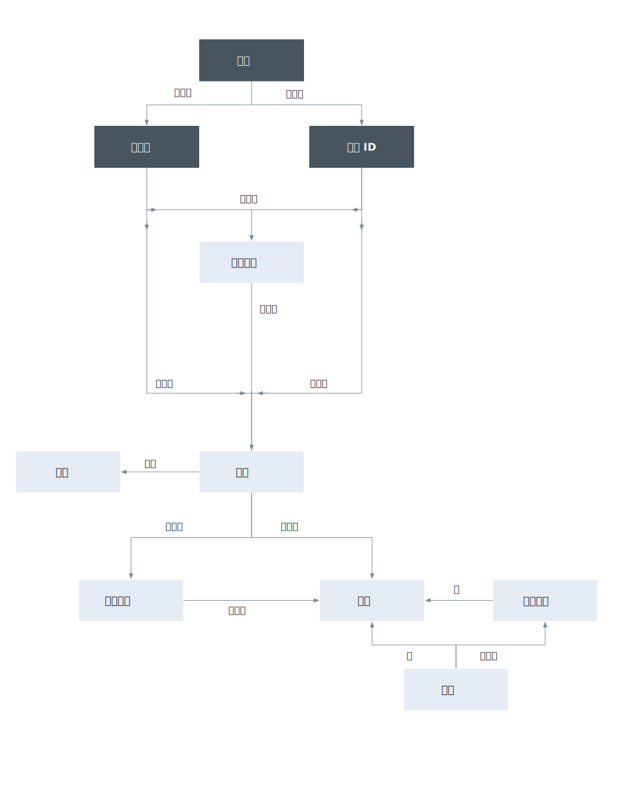

---

copyright:

  years: 2017, 2018

lastupdated: "2018-11-30"

---

{:shortdesc: .shortdesc}
{:codeblock: .codeblock}
{:screen: .screen}
{:new_window: target="_blank"}

# {{site.data.keyword.Bluemix_notm}} Identity and Access Management
{: #iamoverview}

## 何謂 Cloud IAM？

{{site.data.keyword.Bluemix_notm}} Identity and Access Management (IAM) 可讓您安全地鑑別平台服務的使用者，並跨 {{site.data.keyword.Bluemix_notm}} 一致地控制資源的存取。讓一組 {{site.data.keyword.Bluemix_notm}} 服務使用 Cloud IAM 來存取控制，並在帳戶內組織為[資源群組](/docs/account/resourcegroups.html)，讓使用者可以同時快速並輕鬆地存取多個資源。Cloud IAM 存取原則是用來指派使用者及服務 ID 對帳戶內資源的存取權。您可以將使用者及服務 ID 分組為[存取群組](/docs/iam/groups.html)，以將相同的存取層次輕鬆地提供給群組內的所有實體。

原則會指派主體（即使用者、[服務 ID](/docs/iam/serviceid.html#serviceids) 或存取群組），這是一個以上具有屬性組合的角色，這些屬性用於定義對目標的存取範圍。原則可提供對單一服務（直到實例層次）的存取權，對一組在資源群組中組織在一起之資源的存取權，或對帳戶管理服務的存取權。視您指派的 [IAM 角色](/docs/iam/users_roles.html#iamusermanrol)而定，容許主體透過不同層次的存取權來完成帳戶管理作業、使用服務實例，或透過使用者介面或完成 API 呼叫來存取服務。

對於不支援建立 Cloud IAM 原則來管理存取權的服務，您可以使用 [Cloud Foundry 存取](/docs/iam/cfaccess.html#cfaccess)或[標準基礎架構許可權](/docs/iam/infrastructureaccess.html#infrapermission)。

## Cloud IAM 提供哪些特性？
{: #features}

<dl>
<dt>使用者管理</dt>
<dd>統一使用者管理可讓您在平台及標準基礎架構服務的帳戶中新增及刪除使用者。您可以將一群使用者分組為一個存取群組，讓一次指派多個使用者的存取權成為快速而輕鬆的作業。</dd>
<dt>精細存取控制</dt>
<dd>使用者、服務 ID 及存取群組的存取權是透過原則進行定義。在原則內，可以將使用者、服務 ID 或存取群組的存取範圍指派給資源群組中的一組資源、單一資源或是帳戶管理服務。設定範圍之後，您可以藉由選取存取角色來定義原則主體所容許的動作。角色可讓您修改針對原則主體所授與的存取層次，以在原則目標上執行動作，不論它是帳戶內的平台管理作業，還是存取服務的使用者介面或完成 API 呼叫。</dd>
<dt>用於使用者鑑別的 API 金鑰</dt>
<dd>您可以為使用者建立多個 API 金鑰來支援金鑰輪替情境，而且可以使用相同的金鑰來存取多個服務。{{site.data.keyword.cloud_notm}} API 金鑰可讓使用雙因子鑑別或聯合 ID 的使用者從指令行自動鑑別到主控台。使用者也可以有可用來存取標準基礎架構 API 的單一標準基礎架構 API 金鑰；不過，您可以使用 {{site.data.keyword.cloud_notm}} API 金鑰來存取相同的 API 時，不需要這樣做。</dd>
<dt>服務 ID</dt>
<dd>服務 ID 會識別與使用者 ID 如何識別使用者類似的服務或應用程式。應用程式可以使用這些 ID 向 {{site.data.keyword.Bluemix_notm}} 服務進行鑑別。您可以將原則指派給每一個服務 ID，以控制應用程式使用服務 ID 所容許的存取層次，而且可以建立 API 金鑰來啟用鑑別。</dd>
</dl>

## 如何使用 Cloud IAM？

您可以透過「存取 (IAM)」使用者介面、CLI 或 API 來存取及使用 Cloud IAM。

* 若要使用使用者介面來存取 Cloud IAM，請移至**管理** &gt; **存取 (IAM)**。
* 移至[管理 IAM 存取權、API 金鑰、服務 ID 及存取群組](/docs/cli/reference/ibmcloud/cli_api_policy.html#ibmcloud_commands_iam)，以檢閱可用的 CLI 指令。
* 移至下列 API 文件，以檢閱可用的 API：
    * [IAM Identity Services API](https://{DomainName}/apidocs/iam-identity-token-api){: new_window} 
    * [IAM 存取群組 API](https://{DomainName}/apidocs/iam-access-groups){: new_window} 
    * [IAM 原則管理 API](https://{DomainName}/apidocs/iam-policy-management){: new_window} 
